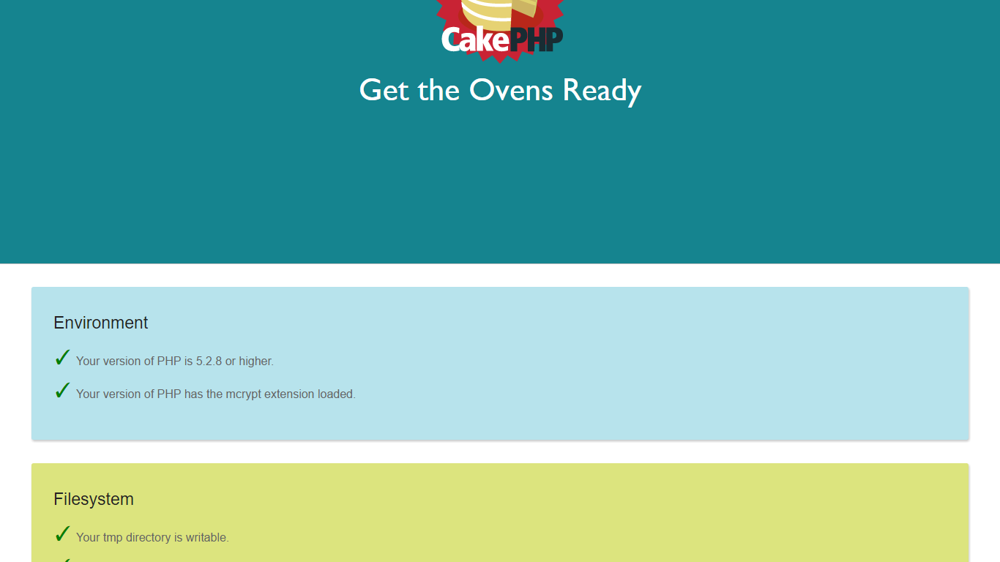

[](LICENSE.txt)

# CakePHP2 Theme プラグイン

Theme プラグインは CakePHP2 の標準の見栄えを CakePHP3 風に変更できる素敵なプラグインです。



他の言語で読む: [English](README.md), **日本語**

## 必須環境

PHP5.3 以上

## インストール

### composer でのインストール

以下のコマンドを実行してください。

```sh
php composer.phar require chinpei215/cakephp-theme
```

### zip でのインストール

任意の [Theme プラグインのリリース](https://github.com/chinpei215/cakephp-theme/releases) (Source code) をダウンロードしてください。
解凍後、 **Theme** という名前での **app/Plugin** ディレクトリに設置してください。

## セットアップ

### プラグインの読込
**app/Config/bootstrap.php** の中でプラグインを有効化してください。

```php
CakePlugin::load('Theme');
```

### ThemeAppShell の継承

**app/Console/Commannd/AppShell.php** を変更して `AppShell` を `ThemeAppShell` の派生クラスに変更してください。
この作業は `bake` が **app/View/Themed** 以下にファイルを作成できるようにするために必要です。

```php
App::uses('ThemeAppShell', 'Theme.Console');

class AppShell extends ThemeAppShell {
}
```

## 基本的な使用方法

### 使用するテーマの指定

AppController でテーマを有効にします。現在は `Cake3` のみが同梱されています。

```php
class AppController extends Controller {
    public $theme = 'Cake3';
}
```

### テーマのインストール

以下のコマンドを実行してテーマをインストールしてください。
`AppController` で指定したテーマが **app/View/Themed** ディレクトリ配下にインストールされます。

```sh
cake theme install
```

### ビューの bake

必要に応じて bake コマンドを実行してビューを作成してください。
`AppController` で指定したテーマのビューが **app/View/Themed** ディレクトリ配下に新たに作成されます。

```sh
cake bake view Users
```

## 高度な使用方法

### 既定のテーマとしてインストール

もし **app/View/Themed** 配下ではなく **app/View** および **app/webroot** を上書きしたい場合は、
まず **app/Config/bootstrap.php** の中で `Theme.default` にテーマを指定してください。

```php
Configure::write('Theme.default', 'Cake3');
```

次に、以下のコマンドを実行してテーマのインストールを行ってください。
```sh
cake theme install
```

この場合、 AppController でのテーマの有効化は不要です。

### 独自テーマの作成

**app/Console/Templates/views/theme** 以下に **app/View/Themed** と同じ構成でファイルを置くことで、
独自テーマを作成することができます。
プラグインの場合には **app/Plugin/PluginName/Console/Templates/views/theme** に置いてください。 

作成した独自テーマは `theme install` コマンドでインストールできるようになります。

```sh
cake theme install --theme MyTheme
```

### bake するテーマの選択

任意のテーマでビューを作成したい場合は、 `--theme` オプションを指定してください。

```sh
cake bake view Users --theme MyTheme
```

有効な候補からテーマを選択したい場合は、値を付けずに `--theme` オプションを指定してください。

```sh
cake bake view Users --theme
```
